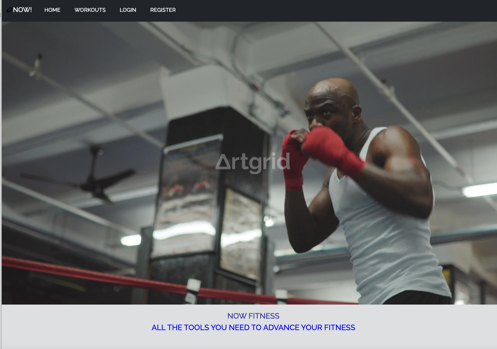
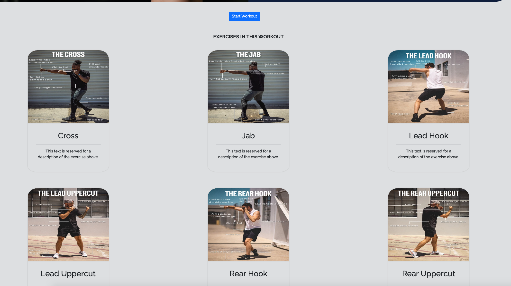

# NOWfitnessv2

User Stories (divided into sprints).
  NEW USER: 
  - User comes to log in page 
    - Register new user form
      - Enter desired username + pw 
      - Submit form
  - Log in with new credentials 
  - On log in user will arrive at index page which shows 
    - Website info 
    - Navbar with access to personal entries, a tracker for their entries, workouts tab to view available workouts, logout option 
  
  ENTRIES:
  - A user can select one of three workouts available on the site and log their performance for that workout.
  - Fields for entry include sets 1-5 as well as notes

TRACKER:
    - In the Tracker tab, users can filter their entries by date or by workout name 
    - In addition when users press get data they will see a visual representation of their entries in a chart 

Screenshots:
##Home

##Workouts + Exercises

##Entry + Tracker

